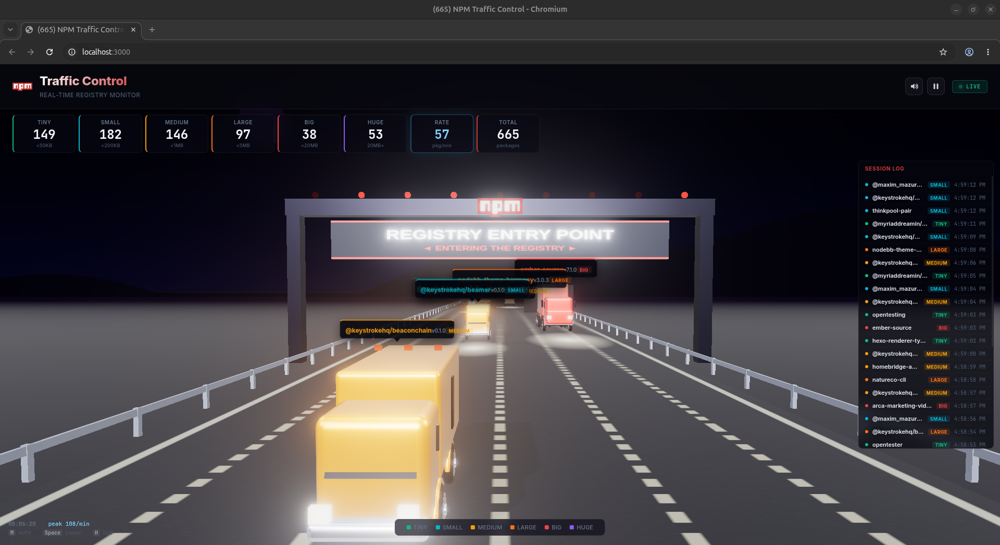

# NPM Traffic Control

<p align="center">
  
</p>

**Real-time npm registry traffic monitor** — every time a package is published or updated, a 3D semi-truck drives it toward you on a perspective night highway and passes through the "NPM REGISTRY ENTRY POINT" toll booth.

## How it works

1. **Server** (`server.ts`) polls npm's CouchDB changes feed (`replicate.npmjs.com/_changes`) every 3 seconds. When a change is found, it fetches the package's unpacked size from `registry.npmjs.org/{name}/latest`.

2. **Categorization** — each package is sorted by size into one of 6 buckets: **tiny** (<50KB), **small** (<200KB), **medium** (<1MB), **large** (<5MB), **big** (<20MB), or **huge** (20MB+). Each category maps to a distinct truck model, color, speed, and scale.

3. **Broadcast** — the package info is pushed over a WebSocket to every connected browser, along with rolling stats (rate, peak, totals).

4. **Visualization** — Three.js renders a PBR-lit 3D scene: a truck spawns at the horizon and drives down a night highway toward you, headlights blooming, wheels rolling, until it passes under the toll-booth gantry.

5. **Arrival** — when the truck passes the illuminated **"NPM REGISTRY ENTRY POINT"** sign, the package has arrived at the registry.

## Scene

The 3D environment is a hand-built night highway:

- **Road** — procedural asphalt texture with dashed lane dividers and shoulder lines, rendered on a 24-unit-wide plane stretching to the horizon.
- **Sky** — canvas-painted gradient (near-black → deep purple → warm orange), 600 stars, and an emissive moon.
- **Mountains** — a sine-wave-generated silhouette ridge behind the road, visible through purple fog.
- **Guard rails** — chrome posts and rail segments along both shoulders.
- **Toll booth** — steel gantry with an illuminated "REGISTRY ENTRY POINT" sign (npm-red on dark), an npm logo badge, and 9 blinking caution lights.

## Trucks

Six vehicle types, each built from Three.js geometries with PBR materials (clearcoat paint, glass, chrome, rubber):

| Category | Vehicle | Scale | Speed | Color |
|----------|---------|-------|-------|-------|
| tiny | Compact sedan | 0.55× | Fast | `#10b981` green |
| small | Delivery van | 0.70× | Fast | `#06b6d4` cyan |
| medium | Box truck | 0.85× | Medium | `#f59e0b` amber |
| large | Long box truck | 1.00× | Medium | `#f97316` orange |
| big | Articulated cab + trailer | 1.25× | Slow | `#ef4444` red |
| huge | Full semi-truck | 1.55× | Slow | `#8b5cf6` purple |

Each truck has dual frame rails, fender arches, working headlights/taillights, rotating wheels, and an HTML label projected from 3D space showing the package name, version, and category badge.

## Sound

Synthesized air horns via the Web Audio API — two slightly-detuned sawtooth oscillators through a lowpass filter with stereo panning by lane position. Only **huge** category trucks honk (35% chance, 2–4 honks per truck). Horn pitch scales inversely with truck size.

## Controls

| Action | Mouse | Keyboard |
| --- | --- | --- |
| Mute / unmute the horns | 🔊 button | <kbd>M</kbd> |
| Pause / resume the traffic | ⏸ button | <kbd>Space</kbd> |
| Hide the HUD (cinematic view) | — | <kbd>H</kbd> |
| Open a package on npmjs.com | click a truck / label / log row | — |

Mute preference is persisted to localStorage. Pausing freezes truck movement while live counters keep ticking.

## Live telemetry

- **Rate** — packages arriving per minute (rolling 60-second window), with all-time **peak** shown bottom-left next to **uptime**.
- **Connection badge** — `CONNECTING` → `LIVE`, `FEED LAG` when npm's feed stalls, `RECONNECTING` / `OFFLINE` if the socket drops. Reconnects use exponential backoff (1s → 15s) without page reload.
- **Session log** — scrollable right-side panel showing the last 200 packages with colored dots, category badges, and timestamps.
- **Cumulative totals** persist to `stats.json` on the server, so the odometer survives restarts.

## Accessibility

- `prefers-reduced-motion` — horns default to muted, bloom is softened, pulsing/bump animations are disabled.
- Adaptive quality — if the frame takes longer than 33ms for 150 consecutive frames, the renderer drops to pixel ratio 1 and halves bloom strength.

## Running it

```bash
bun run start
```

Open `http://localhost:3000` in a browser. Trucks will start rolling in as packages are published to npm in real-time.

### Configuration

All via environment variables:

| Var | Default | Purpose |
| --- | --- | --- |
| `PORT` | `3000` | HTTP / WebSocket port |
| `POLL_MS` | `3000` | how often to poll npm's changes feed |
| `HEARTBEAT_MS` | `5000` | how often the server pushes a telemetry tick |
| `STATS_FILE` | `./stats.json` | where cumulative totals are persisted |

### Health check

```
GET /healthz
```

Returns JSON with status, rolling rate, peak rate, uptime, connected clients, and feed health.

## Tech stack

| Layer | Technology |
| --- | --- |
| Runtime | **Bun** — native HTTP server + WebSocket, TypeScript out of the box |
| 3D engine | **Three.js r184** — vendored locally under `public/vendor/three` (runs fully offline) |
| Rendering | PBR materials, `RoomEnvironment` reflection maps, `UnrealBloomPass` post-processing, PCF soft shadow maps, ACES filmic tone mapping |
| Sound | **Web Audio API** — synthesized horns, no external audio files |
| Fonts | **Inter** (UI), **JetBrains Mono** (telemetry) via Google Fonts |
| Data source | `replicate.npmjs.com/_changes` (live feed), `registry.npmjs.org/{name}/latest` (package sizes) |
| Deployment | Docker (`FROM oven/bun:latest`) |

## Project structure

```
server.ts           Bun HTTP/WebSocket server (276 lines)
public/
  index.html        SPA shell + import map for vendored Three.js
  app.js            All client logic: Three.js scene, trucks, HUD, WebSocket, sound (1305 lines)
  style.css         Dark theme, glass HUD, responsive layout (504 lines)
  vendor/three/     Vendored Three.js r184 (core + full addons tree)
docs/
  screenshot.png
```
